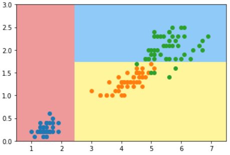

# Entropy-Split-Simulation

使用信息熵寻找最优划分：

在一个节点上，使用信息熵找到当前位置的最优划分方案可以使得完成一次划分后让信息熵的值达到当前这一次划分后的最小值。这样的过程递归下去，最终就形成了决策树。


怎么搜索某个维度上的所有划分：

选择相邻节点的中间值作为划分点

搜索所有维度上的所有划分，本质上是遍历了一遍所有的样本点在该维度上的取值，将所有的样本点在该维度上的取值排序。若有 n 个样本点，那么在某个维度上就有 n-1 种划分方式，计算机不可能遍历所有的数值（数值是无穷多个的），只需要让计算机去遍历排序后相邻样本点的中间的那个取值（其实就是平均值，就是中间点）作为一次尝试的划分点即可。

## 创建决策树模型

```python
import numpy as np
import matplotlib.pyplot as plt
```

```python
# 导入鸢尾花数据集
from sklearn import datasets

iris = datasets.load_iris()
X = iris.data[:, 2:]
y = iris.target 

plt.scatter(X[y==0, 0], X[y==0, 1])
plt.scatter(X[y==1, 0], X[y==1, 1])
plt.scatter(X[y==2, 0], X[y==2, 1])
plt.show()
```

```python
from sklearn.tree import DecisionTreeClassifier

# 创建决策树分类器 ==> entropy=熵 ; max_depth=最大深度
# criterion="entropy" 使用信息熵的方式对数据划分
dt_clf = DecisionTreeClassifier(max_depth=2, criterion="entropy", random_state=42)
dt_clf.fit(X, y)
```

```python
# 绘制模型的边界线
def plot_decision_boundary(model, axis):
    
    x0, x1 = np.meshgrid(
        np.linspace(axis[0], axis[1], int((axis[1]-axis[0])*100)).reshape(-1, 1),
        np.linspace(axis[2], axis[3], int((axis[3]-axis[2])*100)).reshape(-1, 1),
    )
    X_new = np.c_[x0.ravel(), x1.ravel()]

    y_predict = model.predict(X_new)
    zz = y_predict.reshape(x0.shape)

    from matplotlib.colors import ListedColormap
    custom_cmap = ListedColormap(['#EF9A9A','#FFF59D','#90CAF9'])
    
    plt.contourf(x0, x1, zz, cmap=custom_cmap)
```

```python
# 绘制决策树的决策边界
plot_decision_boundary(dt_clf, axis=[0.5, 7.5, 0, 3])
plt.scatter(X[y==0,0], X[y==0,1])
plt.scatter(X[y==1,0], X[y==1,1])
plt.scatter(X[y==2,0], X[y==2,1])
plt.show()
```




## 使用信息熵模拟划分

`split` 函数：传入 X，y 分别是样本的各个维度上的数据以及每个样本对应的标记 target 也就是参数 y

返回值：返回对数据集 X, y 按照 d 和 value 进行划分后的 左边的和右边的数据集

按照返回的参数顺序，返回的依次是：

1. X[index_a] ==> 按照维度 d 并且 value 点划分后的左边的数据集
2. X[index_b] ==> 按照维度 d 并且 value 点划分后的右边的数据集
3. y[index_a] ==> 按照维度 d 并且 value 点划分后的左边的数据集的标记（target）
4. y[index_b] ==> 按照维度 d 并且 value 点划分后的右边的数据集的标记（target）

```python
def split(X, y, d, value):
    index_a = (X[:,d] <= value)
    index_b = (X[:,d] > value)
    return X[index_a], X[index_b], y[index_a], y[index_b]
```


`entropy` 函数：计算样本的信息熵，知道了所有样本的标记 ==> 也就知道了不同类别的样本分别有多少 ==> 从而可确定不同类别样本所占的比例 ==> 最终计算出信息熵

```python
from collections import Counter
from math import log

def entropy(y):
    counter = Counter(y)
    res = 0.0
    for num in counter.values():
        p = num / len(y)
        res += -p * log(p)
    return res
```


`try_split` 函数：尝试对样本 X，y 进行一次最好的划分

返回值 ：返回划分 X, y 数据及后的最好的信息熵（best_entropy)，最好的当前划分是按照哪个维度 (best_d, best_dimension) 进行划分的，在此维度上进行划分的最好的划分值 (best_v, best_value)

```python
def try_split(X, y):
    
    best_entropy = float('inf')
    best_d, best_v = -1, -1
    for d in range(X.shape[1]):
        sorted_index = np.argsort(X[:,d])
        for i in range(1, len(X)):
            if X[sorted_index[i], d] != X[sorted_index[i-1], d]:
                v = (X[sorted_index[i], d] + X[sorted_index[i-1], d])/2
                X_l, X_r, y_l, y_r = split(X, y, d, v)
                p_l, p_r = len(X_l) / len(X), len(X_r) / len(X)
                e = p_l * entropy(y_l) + p_r * entropy(y_r)
                if e < best_entropy:
                    best_entropy, best_d, best_v = e, d, v
                
    return best_entropy, best_d, best_v
```


对初始数据集进行一次划分：

```python
best_entropy, best_d, best_v = try_split(X, y)
print("best_entropy =", best_entropy)
print("best_d =", best_d)
print("best_v =", best_v)
```

**output:**

best_entropy = 0.46209812037329684 
best_d = 0 
best_v = 2.45

获取对初始数据集进行一次划分后的左右两边的数据：

```python
X1_l, X1_r, y1_l, y1_r = split(X, y, best_d, best_v)
```


计算左边的数据集的 信息熵 entropy:

```
entropy(y1_l)
```

**output:**

0.0

计算右边的数据集的 信息熵 entropy:

```
entropy(y1_r)
```

**output:**

0.6931471805599453


对左边的数据集按照信息熵寻找一次划分点：

```python
best_entropy2, best_d2, best_v2 = try_split(X1_r, y1_r)
print("best_entropy =", best_entropy2)
print("best_d =", best_d2)
print("best_v =", best_v2)
```

**output:**

best_entropy = 0.2147644654371359 
best_d = 1 
best_v = 1.75

重复类似的步骤：

```
X2_l, X2_r, y2_l, y2_r = split(X1_r, y1_r, best_d2, best_v2)
```


计算左边的数据集的 信息熵 entropy:

```
entropy(y2_l)
```

**output:**

0.30849545083110386


计算右边的数据集的 信息熵 entropy:

```
entropy(y2_r)
```

**output:**

0.10473243910508653
