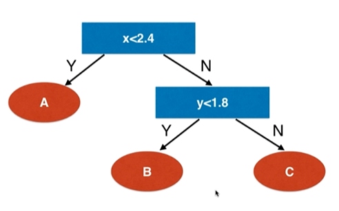
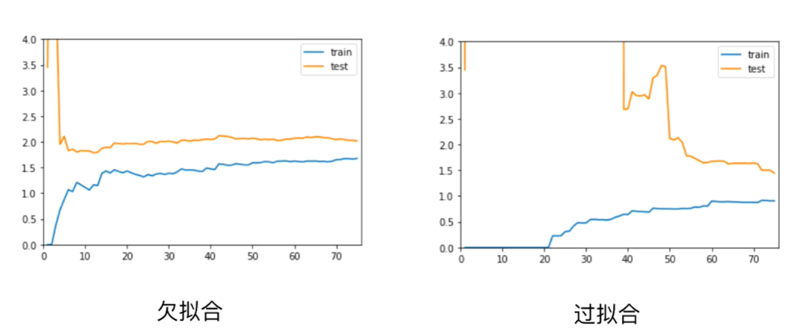
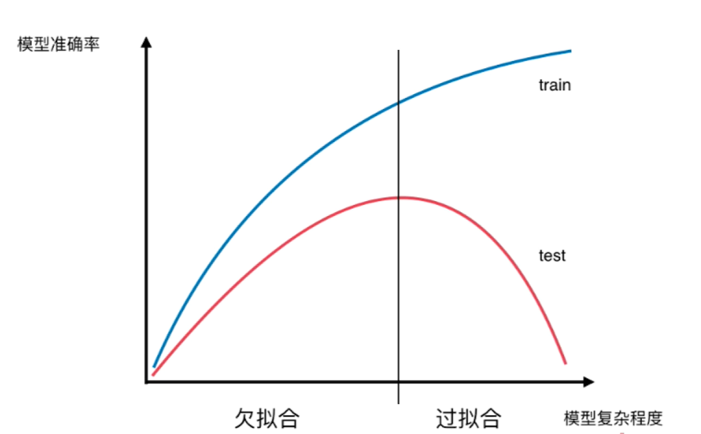

# Decision-Tree-Regressor

创建决策树模型后，在红色的叶子节点上，最终都会包含若干的数据样本：

1. 使得叶子节点的输出值为类别（分类问题） ==> 在叶子节点处投票，哪个类别的样本数据集占比最大那么这个叶子节点的输出值就属于哪个类别，这里的 y_train 是类别标签而不是一个值
2. 使得叶子节点的输出值为一个标量（回归问题） ==> 在叶子节点处对样本数据的 y_train （y_train 不是类别标签而是一个值） 求平均值

## 用决策树解决回归问题

具体的代码见当前目录下的 Jupyter Notebook 文件中的代码

在第 8 章介绍了学习曲线：

模型复杂度曲线：

