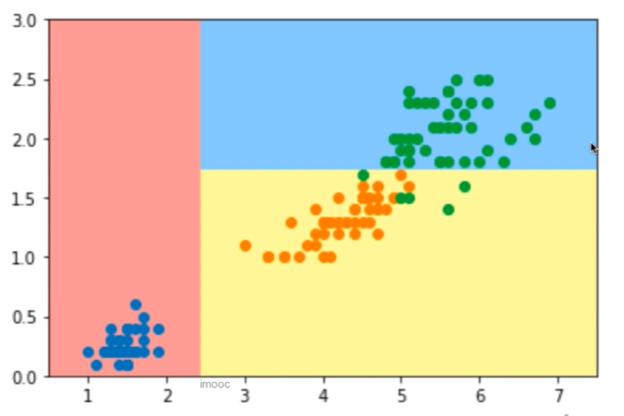
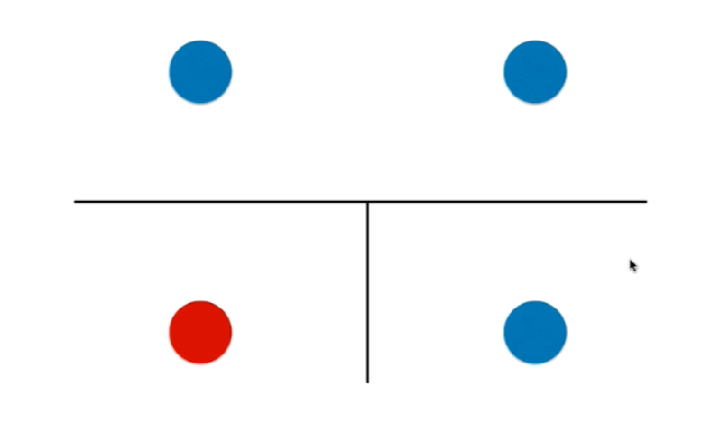
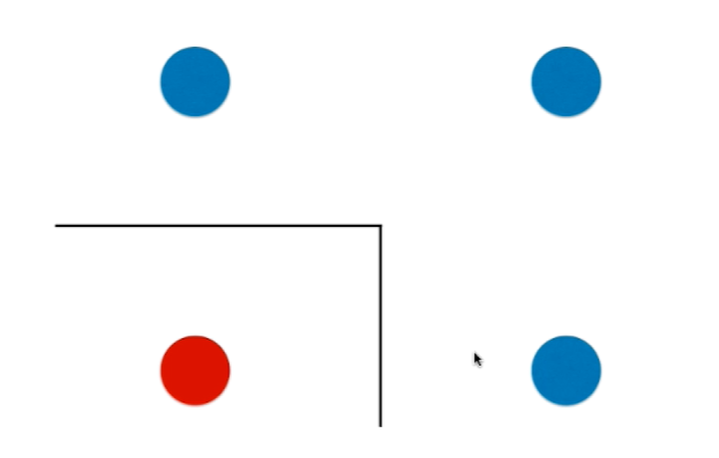
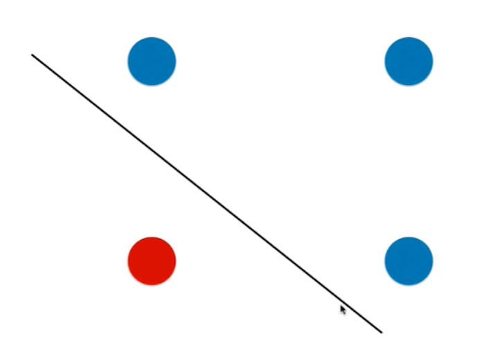
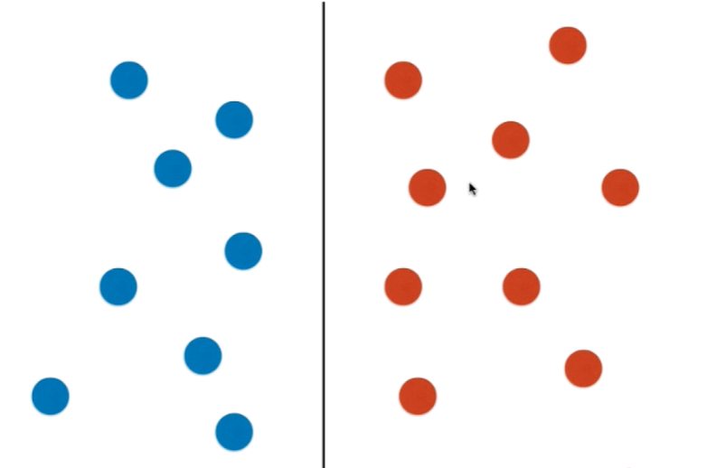
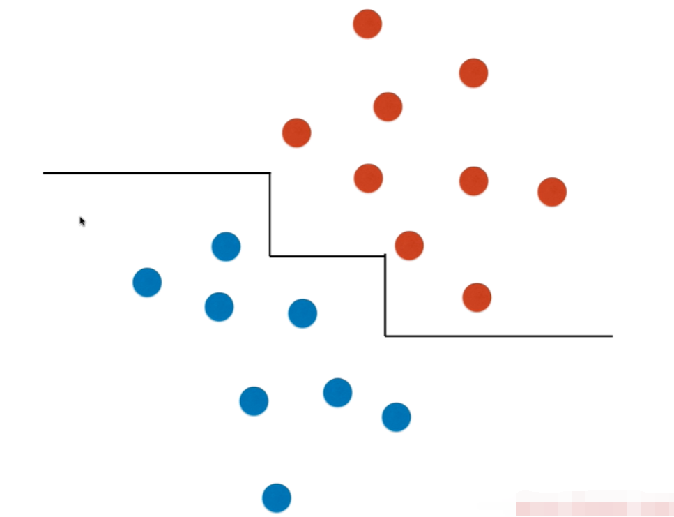
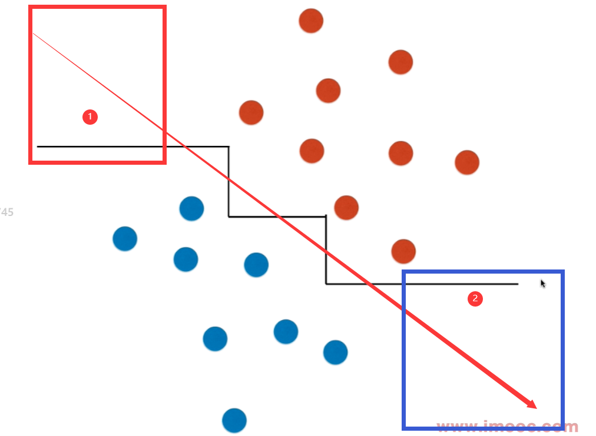

# Problems-of-Decision-Tree

## 决策树的局限性

1. 决策边界都是横平竖直的，因为决策树的构造过程是在某个维度选择一个点将数据集一分为二，所以就造成了决策边界横平竖直的情况

## 理解局限性

如果有这样四个样本数据，那么经过两次划分后会有这样的两根线，在叶子节点上，相同的输出被看作同样的输出，那么在绘制决策边界的时候，可以把右下角的蓝色样本和上边的蓝色样本合并在一起绘制，也就产生了一个有折点的决策边界，但是终究其本质还是一个横平竖直的决策边界，只不过是把相同类别的区域合并在了一起而已。

就像这样：

同时这样的一个决策边界或许不能良好的反应决策边界，因为有可能真实的决策边界应该是下边的这样一根斜线：

对于下边的数据集，决策树可以做出很好的划分：

但是如果仍然是同样分布的数据集，可是数据产生了一些倾斜，那么决策树就不能做出一个比较好的划分了：

这时候做出的划分就不是一个斜着的直线了，而是有很多的折点，实际上是因为有多个决策树的叶子节点，很多叶子节点的输出的类别值又是相同的，这些相同的类别区域合并后产生的一个总体的决策边界的效果才是这样的一个折线的情况：

即使样本只有两个维度，但是若父亲节点不能将样本进行很好的划分（也就是在父亲节点划分完成一次后，它的子节点仍然有多个类别的样本），那么在不限定决策树的高度的情况下，其实是可以一直划分下去的直到信息熵或者说是基尼系数为零才停下:

会有什么问题？

对于 1 号部分的决策边界，实际上该决策边界可能应该是斜线，但是经过决策树的模型后，在 1 号决策树边界的横线黑色边界上的所有区域都被当作是了红色的数据集的区域，但是这部分从斜直线的决策边界的角度来看是可以包含蓝色的样本数据的 ==> 对于 2 号部分同样是有类似的问题 ==> 最糟糕的是在黑色决策边界分别向左右延申的远端是没有数据样本的，这样以来越远的地方预测的效果偏差越大：

## 举个例子

决策树的决策边界 ==> 对于某个数据样本是非常敏感的

具体分析以及相关代码见同目录下的 Jupyter Notebook 中的代码以及注释

决策树重要的应用 ==> 使用决策树创建随机森林 ==> 可以得到很好的效果