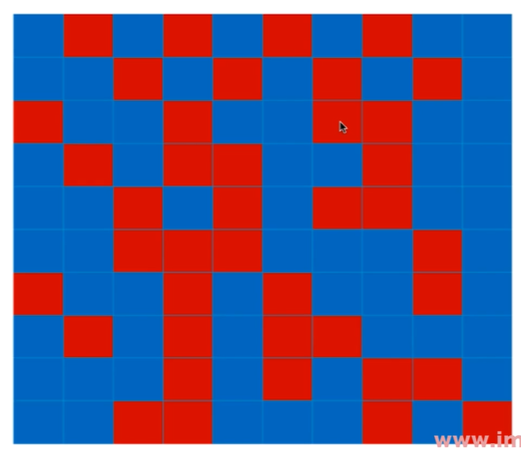

# OOB-and-More-about-Bagging-Classifier

OOB : Out-Of-Bad

放回取样带来的问题：

放回取样导致一部分样本很可能没有取到

对于上一小节的例子而言，平均大约有 37% 的样本没有被取到过

那么这 37% 的样本就叫做 OOB (Out-Of-Bad)

那么也就不需要使用测试数据集，而使用这些从来没有被取到过的样本作为最终的测试数据集来使用，来测试或验证模型的泛化能力

那么再 `scikit-learn` 中也有一个对应的值是 `oob_score_`，就是使用 `OOB` 那一部分数据作为测试数据集后的 `score` 的值（即准确率）

## Bagging 的更多探讨

针对特征进行随机采样

Random Subspaces ==> 随机子空间

既针对样本，又针对特征进行随机采样

Random Patches ==> 随机的补丁 ~ 

既在行的维度上（不同的样本），又在列的维度上随机（不同的特征）采样：

