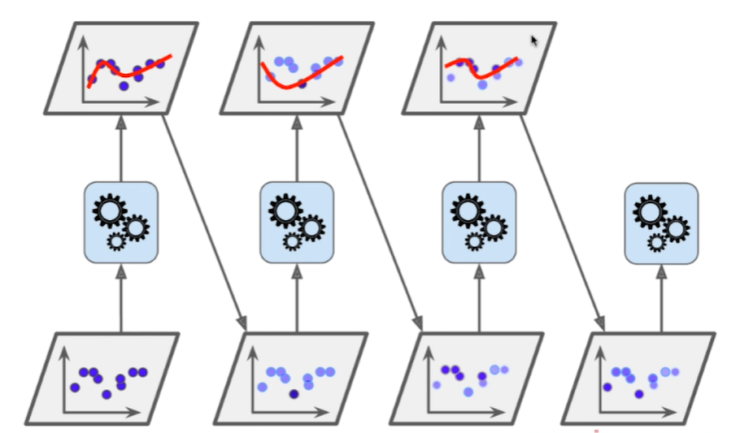
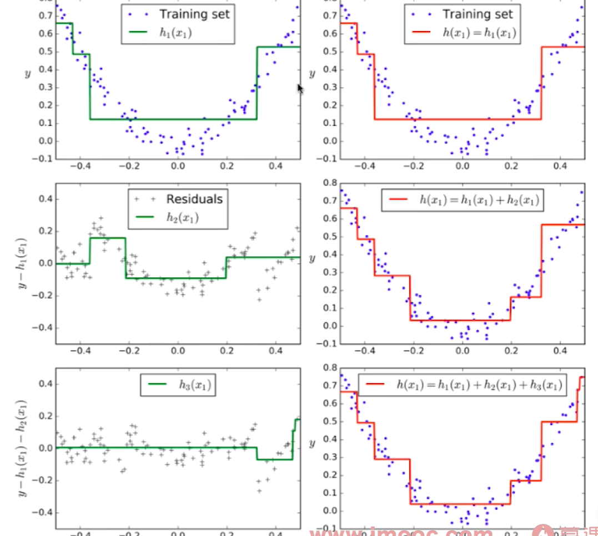

# AdaBoost-and-Gradient-Boosting

Boosting : 

1. 集成多个模型
2. 每个模型都在尝试增强（Boosting）整体的效果

解释：

1. 齿轮代表某一种机器学习算法
2. 其中深色的数据点代表没有被算法很好地学习的数据样本点，深色则代表当前的样本的被学习的权重要重一点
3. 其中浅色的样本点刚好与深色的样本点相反，代表此样本点需要被学习的权重要低一些
4. 每一次算法的学习，都是在尝试弥补上一次算法学习所生成的模型的不足，所以这样的机器学习策略称为 Boosting，代表是一次一次的算法学习都是为了推动为了增强且弥补上一次的模型的不足之处

## 代码

在这里不对 AdaBoosting 背后的数学原理做推导

==> 可见同目录下的 Jupyter Notebook 文件

==> 只介绍下如何使用 `AdaBoosting` 策略在 `scikit-learn` 中的接口使用方法

因为 AdaBoosting 需要很多次创建模型，不停地推动模型向更好的方向发展，所以在创建 AdaBoosting 的时候，需要传入一个参数，此参数代表在这个策略中使用什么机器学习算法来一次一次的推动模型的进一步发展

# Gradient Boosting

- 训练一个模型m1,产生错误e1
- 针对e1训练第二个模型m2，产生错误e2
- 针对e2训练第三个模型m3，产生错误e3...
- 最终预测结果是: m1 + m2 + m3 + ...

下一模型的训练数据集 = 是上一个模型预测时犯错的那些数据所组成的数据集

一个例子：

自上而下，自左向右的看：

1. 左边绿色的图的模型，是针对它的右上方的模型所犯错的那些数据组成的数据集进行训练后的模型，而不是综合了之前的模型后这样的一个模型
2. 左边绿色的图的模型的右边的红色图像模型 = 其（右边的红色图像模型）左边的绿色模型 + 其正上方的红色模型 ==> 所综合考虑后的一个新的模型

