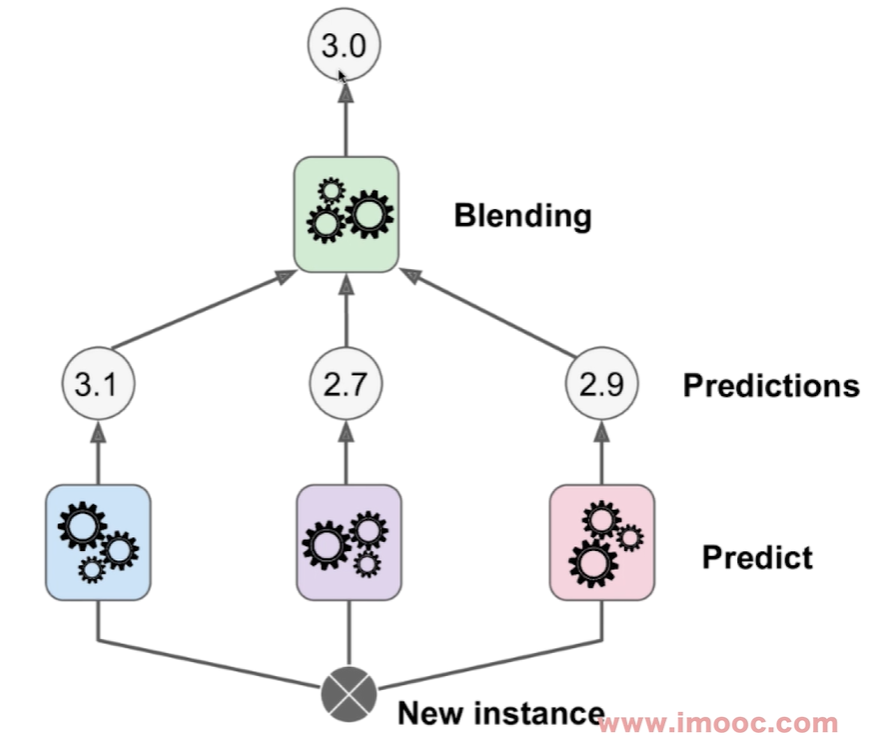
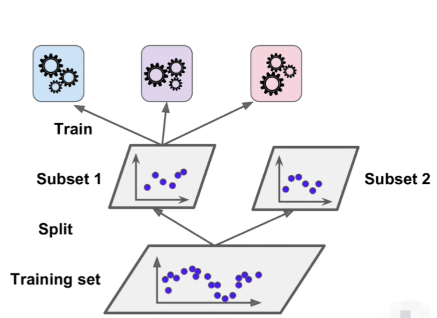
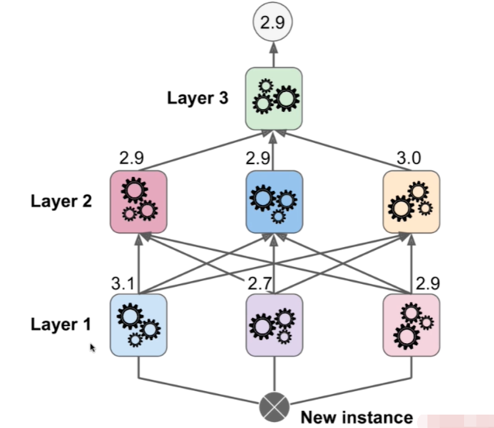

# Stacking

- 集成学习的另外一个思路：Stacking ==> 表达的就是落的意思，堆叠、落在下方的模型上层
- 选择一些模型，再将这些模型的输出结果作为上层模型的输入，以此来训练模型

## 举个例子

- 将最下方的 Training set 初始数据集 分割 split 成为两个子数据集，其中一份子数据集用来训练下层的三个模型，另外一份数据集用来训练上层的模型:

## 更加复杂的模型

对于 Stacking 思路创建模型，那么该模型由几层组成，就将初始数据集分割成为几份：

这样的模型非常像神经网络的样子，因为模型非常复杂，所以深度学习往往会产生过拟合的情况。

为什么呢？因为模型越复杂，越能拟合训练数据集的所有样本，但是这样的模型可能非常扭曲非常畸形地拟合了训练数据集所有的样本，但是这样就已经过拟合了。

